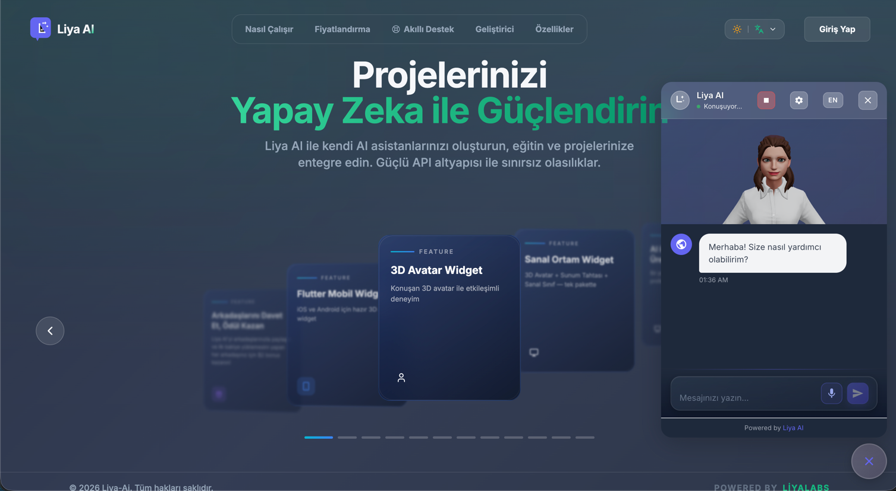
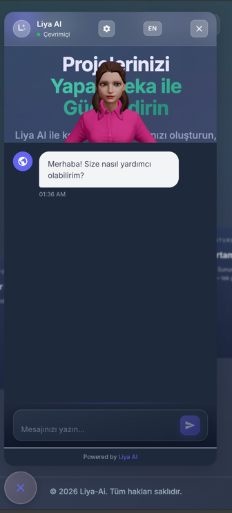
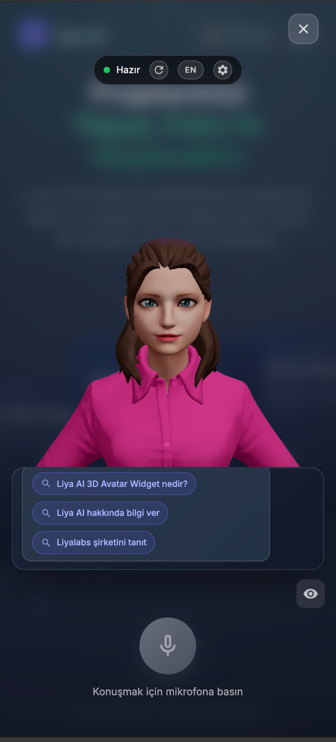
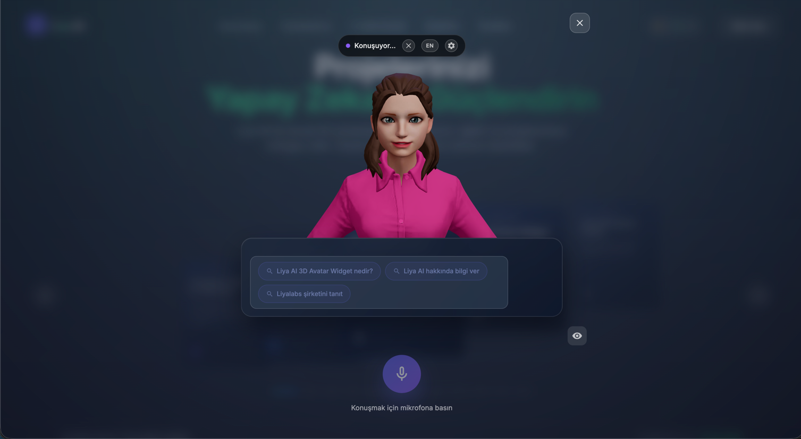
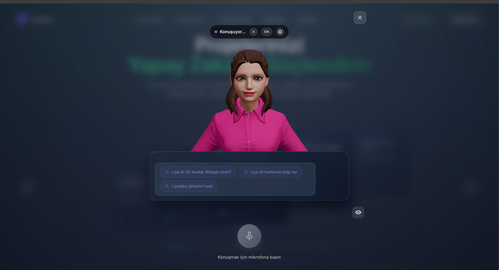

# @liyalabs/liya-3d-avatar-widget-vuejs

3D Talking Avatar Widget - AI Assistant with real-time lip-sync animation for Vue.js 3.

[](https://www.npmjs.com/package/@liyalabs/liya-3d-avatar-widget-vuejs)
[](https://opensource.org/licenses/MIT)

> **[Live Demo →](https://ai.liyalabs.com)** &nbsp;|&nbsp; **[Website →](https://liyalabs.com)** &nbsp;|&nbsp; **[API Docs →](https://ai.liyalabs.com/developer)**

## Screenshots

### Widget & Avatar Modal

| Widget (Chat Panel) | Avatar Modal (Lip-sync) |
|---------------------|------------------------|
|  |  |

### Mobile

| Mobile Widget | Mobile Avatar |
|---------------|---------------|
|  |  |

### Avatar Lip-sync in Action

| Idle | Speaking |
|------|----------|
|  |  |

## Features

- 🎭 **3D Avatar** - Three.js powered 3D avatar with customizable models (GLB/GLTF)
- 👄 **Lip-Sync** - Real-time lip synchronization using viseme data
- 🎤 **Voice Input** - Speech-to-text for hands-free interaction
- 🔊 **Voice Output** - Text-to-speech with avatar animation
- 💬 **Full Chat** - Complete chat widget with session history
- 📎 **File Upload** - Attach files to conversations
- 🖼️ **Media Display** - Inline image and video rendering in chat messages
- 💡 **Suggestions** - Quick reply suggestions
- 🎨 **Customizable** - Theming, positioning, and branding options
- 🌐 **i18n** - Turkish and English support

## Installation

```bash
npm install @liyalabs/liya-3d-avatar-widget-vuejs
# or
yarn add @liyalabs/liya-3d-avatar-widget-vuejs
# or
pnpm add @liyalabs/liya-3d-avatar-widget-vuejs
```

## Quick Start

### 1. Initialize the Plugin

```typescript
// main.ts
import { createApp } from 'vue'
import App from './App.vue'
import LiyaAvatarWidget from '@liyalabs/liya-3d-avatar-widget-vuejs'
import '@liyalabs/liya-3d-avatar-widget-vuejs/style.css'

const app = createApp(App)

app.use(LiyaAvatarWidget, {
  mode: 'widget',
  baseUrl: 'https://app-X-ai.liyalabs.com', // Your assigned backend URL (see GAR section)
  apiKey: 'your-api-key',
  assistantId: 'your-assistant-id',
  assistantName: 'AI Assistant',
  locale: 'tr' // 'tr' or 'en'
})

app.mount('#app')
```

### 2. Use the Widget Component

```vue
<template>
  <LiyaAvatarWidget
    :show-avatar-button="true"
    avatar-model-url="/models/avatar.glb"
    welcome-message="Merhaba! Size nasıl yardımcı olabilirim?"
    @avatar-opened="onAvatarOpened"
    @message-sent="onMessageSent"
  />
</template>

<script setup>
import { LiyaAvatarWidget } from '@liyalabs/liya-3d-avatar-widget-vuejs'

function onAvatarOpened() {
  console.log('Avatar modal opened')
}

function onMessageSent(message) {
  console.log('Message sent:', message)
}
</script>
```

## Components

### LiyaAvatarWidget

Main widget component with chat panel and avatar button.

#### Props

| Prop | Type | Default | Description |
|------|------|---------|-------------|
| `position` | `'bottom-right' \| 'bottom-left' \| 'top-right' \| 'top-left'` | `'bottom-right'` | Widget position |
| `theme` | `ThemeConfig` | `{}` | Theme customization |
| `assistantName` | `string` | `''` | Name of the AI assistant |
| `welcomeMessage` | `string` | `''` | Welcome message shown on load |
| `welcomeSuggestions` | `string[]` | `[]` | Quick reply suggestions |
| `placeholder` | `string` | `''` | Chat input placeholder |
| `showBranding` | `boolean` | `true` | Show Liya branding |
| `showVoice` | `boolean` | `true` | Show voice input button |
| `voiceEnabled` | `boolean` | `true` | Enable voice (false shows disabled mic for STANDARD accounts) |
| `showFileUpload` | `boolean` | `true` | Show file upload button |
| `showAvatarButton` | `boolean` | `true` | Show "Talk with Avatar" button |
| `avatarModelUrl` | `string` | `''` | URL to GLB/GLTF avatar model |
| `offsetX` | `number` | `20` | Horizontal offset in pixels |
| `offsetY` | `number` | `20` | Vertical offset in pixels |
| `autoSpeak` | `boolean` | `true` | Auto-speak assistant responses |
| `animateButton` | `boolean` | `true` | Attention animation on toggle button |
| `viewOnPageStart` | `boolean` | `false` | Auto-open widget on page load |
| `liyaWidgetMode` | `'standard' \| 'modal_kiosk' \| 'kiosk'` | `'standard'` | Widget display mode |
| `closeButtonEnabled` | `boolean` | `true` | Show close button |
| `locale` | `string` | `''` | Language (`'tr'` or `'en'`, defaults to browser) |

#### Events

| Event | Payload | Description |
|-------|---------|-------------|
| `opened` | — | Chat panel opened |
| `closed` | — | Chat panel closed |
| `avatarOpened` | — | Avatar modal opened |
| `avatarClosed` | — | Avatar modal closed |
| `messageSent` | `string` | User sent a message |
| `messageReceived` | `string` | Assistant responded |
| `searchResults` | `{ annotations, response, sessionId }` | Web search citations returned |

### AvatarModal

Standalone full-screen avatar modal with integrated chat.

```vue
<template>
  <AvatarModal
    :is-open="isOpen"
    model-url="/models/avatar.glb"
    assistant-name="AI Assistant"
    @close="isOpen = false"
  />
</template>
```

### AvatarScene

Low-level 3D avatar renderer (Three.js). Use this for custom integrations.

```vue
<template>
  <AvatarScene
    model-url="/models/avatar.glb"
    :width="400"
    :height="500"
    :is-speaking="isSpeaking"
    :visemes="visemeData"
    :current-time="audioTime"
    :lip-sync-intensity="0.5"
  />
</template>
```

#### AvatarScene Key Props

| Prop | Type | Default | Description |
|------|------|---------|-------------|
| `modelUrl` | `string` | `''` | GLB/GLTF model URL |
| `width` | `number` | `400` | Canvas width |
| `height` | `number` | `500` | Canvas height |
| `isSpeaking` | `boolean` | `false` | Trigger speaking animation |
| `visemes` | `VisemeData[]` | `[]` | Lip-sync timing data from backend |
| `currentTime` | `number` | `0` | Audio playback time (drives viseme sync) |
| `lipSyncIntensity` | `number` | `0.5` | Mouth opening intensity (0–1) |
| `autoSpeak` | `boolean` | `true` | Auto-speak on text change |

## Avatar Models

The widget supports GLB/GLTF models with ARKit-compatible blend shapes for lip-sync:

- **Ready Player Me** avatars (recommended — full ARKit blend shape support)
- Custom models with viseme morph targets

### Supported Viseme Morph Targets

```
viseme_PP, viseme_FF, viseme_TH, viseme_DD, viseme_kk,
viseme_CH, viseme_SS, viseme_nn, viseme_RR, viseme_aa,
viseme_E, viseme_I, viseme_O, viseme_U
```

## API Functions

```typescript
import {
  generateAvatarSpeech,
  textToSpeech,
  sendMessage,
  useChat,
  useVoice
} from '@liyalabs/liya-3d-avatar-widget-vuejs'

// Generate speech with viseme data for lip-sync
const result = await generateAvatarSpeech('Merhaba!', { voice: 'nova' })
console.log(result.visemes)      // Lip-sync timing data
console.log(result.audio_base64) // Base64-encoded audio
console.log(result.audio_format) // 'mp3' (iOS/Safari) or 'opus' (others)

// Text-to-speech only (no visemes)
const audioBlob = await textToSpeech('Merhaba!', { voice: 'nova', speed: 1.0 })

// Chat composable
const { messages, sendMessage, isLoading, currentSessionId } = useChat()

// Voice composable (STT)
const { isRecording, transcript, startRecording, stopRecording } = useVoice()
```

## Media Display

When the AI assistant returns images or videos in its response (e.g. from image generation), the widget automatically renders them as inline thumbnails. Clicking a thumbnail emits the `media-click` event.

Chat messages now include a `media` field:

```typescript
interface MessageMediaItem {
  type: 'image' | 'video'
  url: string
  alt?: string
  source?: string
}
```

The `MessageBubble` component handles both the backend `media[]` array and markdown-embedded images/videos as a fallback.

## Backend Requirements

This widget requires the Liya AI backend. The complete OpenAPI specification
(**LiyaAi-Api-External-V0**, v0.1.0) is available on the developer page:

**[Developer Docs & API Reference →](https://ai.liyalabs.com/developer)**

Download the spec directly (Endpoints tab → OpenAPI Specification):

| Language | View / Download |
|----------|----------------|
| 🇬🇧 English | [LiyaAi-Api-External-V0-en.yaml](https://ai.liyalabs.com/LiyaAi-Api-External-V0-en.yaml) |
| 🇹🇷 Türkçe | [LiyaAi-Api-External-V0-tr.yaml](https://ai.liyalabs.com/LiyaAi-Api-External-V0-tr.yaml) |

The spec follows Semantic Versioning. While on **0.x**, breaking changes may occur without prior notice — subscribe to [liyalabs.com/changelog](https://liyalabs.com/changelog).

### Core Endpoints Used

| Method | Endpoint | Description |
|--------|----------|-------------|
| POST | `/api/v1/external/chat/` | Send message, get response |
| POST | `/api/v1/external/chat/with-files/` | Send message with file attachments |
| GET | `/api/v1/external/sessions/` | List sessions |
| POST | `/api/v1/external/sessions/` | Create session |
| DELETE | `/api/v1/external/sessions/{id}/` | Delete session |
| GET | `/api/v1/external/sessions/{id}/history/` | Get chat history |
| POST | `/api/v1/external/files/` | Upload file |
| GET | `/api/v1/external/assistants/` | List assistants |
| POST | `/api/v1/external/tts/` | Text-to-speech (audio blob) |
| POST | `/api/v1/external/avatar/speech/` | TTS with viseme data (PREMIUM+) |
| GET | `/api/v1/external/avatar/model/` | Get avatar model URL (PREMIUM+) |
| GET | `/api/v1/external/user/access/` | Check feature access |
| GET | `/api/v1/external/tasks/{id}/status/` | Async task status (image/video gen) |

### Authentication

All requests require the `X-API-Key` header:

```
X-API-Key: your-api-key
```

Get your API key from your [Liya AI Dashboard](https://ai.liyalabs.com) under **Projects → API Keys**.

## Theme Customization

```vue
<LiyaAvatarWidget
  :theme="{
    primaryColor: '#6366f1',
    backgroundColor: '#ffffff',
    textColor: '#374151',
    borderRadius: '16px',
    fontFamily: 'Inter, sans-serif',
    position: 'bottom-right',
    widgetSize: 'medium',
    zIndex: 9999
  }"
/>
```

## GAR (Global Application Router)

Liya AI uses a distributed backend architecture. Each project is routed to a specific backend instance via GAR.

Your backend URL is shown in your dashboard under **Settings → API Configuration**:

```
https://app-{X}-ai.liyalabs.com
```

Where `{X}` is your assigned instance number.

| Instance | Backend URL |
|----------|-------------|
| 1 | `https://app-1-ai.liyalabs.com` |
| 2 | `https://app-2-ai.liyalabs.com` |
| 3 | `https://app-3-ai.liyalabs.com` |

Use this URL as the `baseUrl` in your plugin configuration.

## Account Types & Feature Access

| Feature | STANDARD | PREMIUM | PREMIUM PLUS |
|---------|----------|---------|--------------|
| Chat | ✅ | ✅ | ✅ |
| File Upload | ❌ | ✅ | ✅ |
| Voice Input (STT) | ✅ | ✅ | ✅ |
| Voice Output (TTS) | ❌ | ✅ | ✅ |
| 3D Avatar | ❌ | ✅ | ✅ |
| Custom Avatar | ❌ | ❌ | ✅ |
| Kiosk Mode | ❌ | ❌ | ✅ |

## Browser Support

| Browser | Chat | Voice Input | 3D Avatar | Audio |
|---------|------|-------------|-----------|-------|
| Chrome 90+ | ✅ | ✅ | ✅ | Opus |
| Firefox 90+ | ✅ | ✅ | ✅ | Opus |
| Safari 15+ | ✅ | ✅ (iPadOS 16+) | ✅ | MP3 |
| Edge 90+ | ✅ | ✅ | ✅ | Opus |
| iOS Safari | ✅ | ✅ (iOS 16+) | ✅ | MP3 |

**Minimum requirements:** ES6+, WebGL 1.0, AudioContext

## Changelog

### 0.0.6 (2026-04-11)

**Features**
- **feat:** Media display support — inline image and video rendering in chat messages
- **feat:** Backend `media[]` array support in `MessageBubble` with markdown fallback
- **feat:** `MessageMediaItem` type added to `types/index.ts`
- **feat:** `media-click` event on `MessageBubble`
- **fix:** `media` field now properly passed to assistant messages in `useChat`

**Kiosk / modal_kiosk layout fixes**
- **fix:** Message bubbles no longer clipped at the bottom of the chat area (`flex-start` + auto-scroll)
- **fix:** Avatar canvas height is now calculated from the actual rendered controls height (`getBoundingClientRect`) so the avatar head no longer shifts into the status bar when messages arrive
- **fix:** Large-screen / 4K canvas overflow — canvas width is now capped to the effective CSS container width instead of the raw viewport width
- **feat:** New `@media (min-width: 1920px)` and `@media (min-width: 2560px)` breakpoints for proper scaling on TV / 4K displays

### 0.0.5

- Initial public release
- 3D avatar with real-time lip-sync
- Voice input/output
- File upload support
- Session history
- Multi-language support (TR/EN)
- Standard, modal_kiosk, and kiosk modes

## Live Demo

- **Platform**: [ai.liyalabs.com](https://ai.liyalabs.com) — Create an assistant and interact with the 3D avatar
- **Website**: [liyalabs.com](https://liyalabs.com)

## License

MIT © Liya Labs

## Support

- 🌐 Website: [liyalabs.com](https://liyalabs.com)
- 📖 API Docs: [ai.liyalabs.com/developer](https://ai.liyalabs.com/developer)
- 🐛 Issues: [GitHub Issues](https://github.com/liyalabs/liya-3d-avatar-widget-vuejs/issues)
- 📧 Email: support@liyalabs.com
